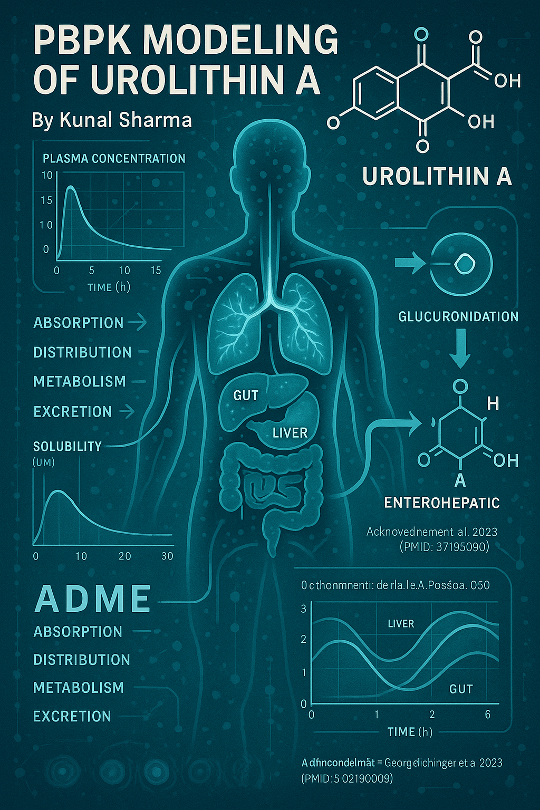

<p align="center">
  
</p>

Urolithin A PBPK modeling toolkit: simulate, analyze, and visualize UA kinetics and sensitivity in humans.

Model and tooling for Urolithin A PBPK predictions in humans, capturing UA and UAGluc dynamics, dissolution, and enterohepatic recycling. Includes a CLI entry point plus sweep scripts so you can explore ADME sensitivity with `uv`-managed Python.

Acknowledgment- This work is inspired by the PBPK model of Georg Aichinger et al. 2023 (PMID: 37195009) and represents an independent re-implementation and mathematical extension for research use.

## Contents

- `Directory structure` – quick tour of source, data, and results
- `Setup` – install dependencies and boot the environment
- `Simulations` – how to run the model and read outputs
- `Sweeps & visualizations` – sensitivity analyses and plots
- `Internal modules` – what each core package delivers

## Directory structure

- `src/` – installable package exposes `pbpk` entry points and contains `parameters`, `flows`, `model`, dissolution helpers, and `simulation` driver logic.
- `sweeps/` – utilities for parameter sweeps (e.g., dissolution, motility, splanchnic blood flow, plasma levels) that emit `.png` reports.
- `comparator/` – plotting helpers used when comparing sweeps or configurations.
- `simulate.py` & `simulate_back.py` – command-line entrypoints that load the model, run `solve_ivp`, and summarize the time-course results.
- `results/` – rendered `.png` outputs from sweeps and demonstrations.
- `molecule_profiles.py` – data classes for prototyping new chemotypes and exposures.
- `pyproject.toml` (with `uv.lock`) – dependency and packaging metadata for `uv pip install -e .`.

## Setup

1. Install `uv` (if needed):

```bash
curl -LsSf https://astral.sh/uv/install.sh | sh
```

2. Sync the environment and install editable mode:

```bash
uv sync --all-extras
uv pip install -e .
```

The commands register the dependencies listed under `pyproject.toml` and `uv.lock`, keeping the CLI and package imports consistent.

## Simulations

```bash
python simulate.py
```

The script prints plasma summaries for UA and UAGluc, reports computed `C_max`/`T_max`, and dumps the first rows of the trajectory table. Use `simulate_back.py` for alternative output formatting.

## Sweeps & visualizations

- Run `sweeps/dissolution_sweep.py`, `sweeps/k_ehr_sweep.py`, or the `splanchnic_*` sweep scripts to regenerate `results/*.png` for PK sensitivity plots.
- The `results/` folder archives the latest visualization artifacts. Each sweep script outputs dose profiles, dissolution modes, and motility-dependent plasma shapes that are useful when tuning oral dosing strategies.
- `comparator` helpers add configurable plotting styles and annotations when you compare multiple sweep outputs.

## Internal modules

- `src/parameters.py` – physiological volumes, blood flows, partition coefficients, and enzyme kinetics used across UA/UAGluc compartments.
- `src/flows.py` – converts amounts to concentrations, calculates directional flows, and evaluates Michaelis-Menten reaction rates for metabolism and clearance.
- `src/model.py` – defines the full ODE system, coupling UA and UAGluc compartments with enterohepatic recirculation and dissolution terms.

All scripts import through the `pbpk` module (`src/pbpk.py`), so installing the package keeps CLI entry points interchangeable with programmatic workflows.
